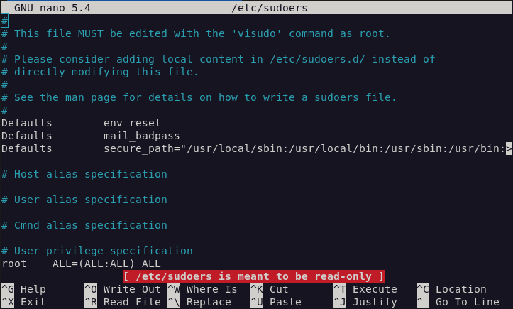

# **Problem - 0 :** I am unable to be root user in debian after fresh installation. It shows 'My username is not in the sudoers file'.

- Open your terminal.
- Type
     ```sh
     su
     ```
     Then enter your password and your root. But our work is done yet.
     
- Then type
     ```sh
     nano /etc/sudoers
     ```
      <br>
     And a window will open up with some codes written. Don't be overwhelmed. Just follow the steps. <br>
     
- Now, scroll down a little bit and you will find line `root     ALL=(ALL:ALL) ALL`. You have to add a new line at the bottom of it. You have to type
     ```sh
     your-username  ALL=(ALL:ALL) ALL
     ``` 
     Here my username is "marzan" and so I have used "marzan" in the place of "your-username" <br>
     
- We are about to end. Only some steps are left. Now, press `ctrl + x` and a window will open up. Just type a capital Y
     
     <br>
     And then another prompt will open. Here, press enter.
     
