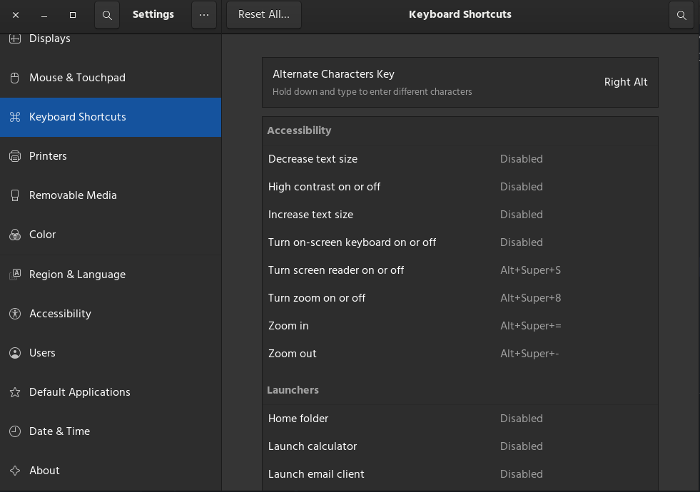

# **Problem - 3 :** `ctrl + alt + t` is not opening terminal in Debian?  

#### **Description:** The keyboard shortcut of terminal is not working in Debian (Gnome) or in other distros. This is a common problem seen after installing debian. Now, we will solve it. We are just a few clicks behind.

### Follow the steps
1. Open `Settings`
2. Search or scroll down to keyborad shortcuts and then open it.
     
3. Scroll down to the bottom and click the `+` icon to create a shortcut.
     
4. A window will pop up. Here in the *Name* field type `Open Terminal` and in the *Command* field type `gnome-terminal`. Finally, click in the *set shortcut* and press `ctrl + alt + t` or any other keys you want to add as shortcut. Then click in Add button at the top. **You will see  a *add* button in the top right corner. I have done this precedure before and so it's not showing.**
     

#### So, this is the way to solve it a graphical way. If you face any issue, you can create an issue. I will try to solve it. :star2: