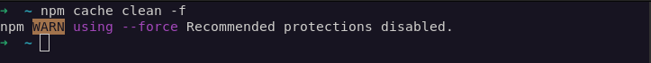
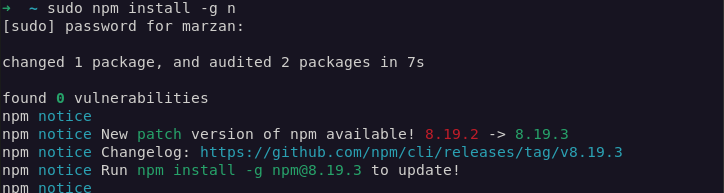
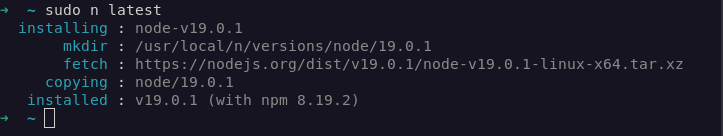
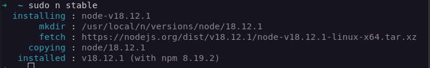
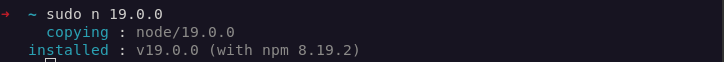

# **Problem - 1 :** How to update my Node.js version in linux / Debian / Ubuntu / Kali?  

#### There is a common problem seen by the linux users that when they install Node.js, the version of Node.js is pretty much older. And now, you want to update it to the latest version or the stable version or to any other version of Node.js. You will find many solution across the web. But I will show you one of the most easiest ways of solving the problem.

## Prequisites
 - Should have npm installed

    Install npm in Debian / Ubuntu / or ZorinOS
     ```sh
    sudo apt install npm
     ```
     Install npm in Fedora and in it's derivatives
     ```sh
    sudo dnf install npm
     ```

### Now you are ready to update your Node.js version
1. Clear the cache of npm
   ```sh
    npm cache clean -f
    ```
    
2. Install Node version manager
   ```sh
    sudo npm install -g n
    ```
    
3. Now you have three choice. Either install the latest version or the stable version or any other version you want.
   1. Install the **Latest** version
        ```sh
        sudo n latest
        ```
        
    2. Install the **Stable** version
         ```sh
         sudo n stable
         ```
         
    3. Install a **version of you choice**
        ```sh
        sudo n [version.number]
        ```
        for example
        ```sh
        sudo n 19.0.0
        ```
        

#### And in this way you can update your node version. If you face any issue, you can create an issue. I will try to solve it. :star2: