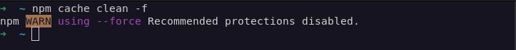
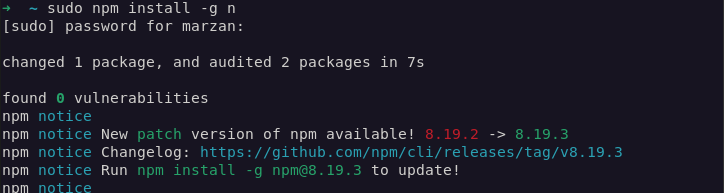

# **Problem - 1 :** How to update my Node.js version in linux / Debian / Ubuntu / Kali?  

#### There is a common problem seen by the linux users that when they install Node.js, the version of Node.js is pretty much older. And now, you want to update it to the latest version or the stable version or to any other version of Node.js. You will find many solution across the web. But I will show you one of the most easiest ways of solving the problem.

## Prequisites
 - Should have npm installed

    Install npm in Debian / Ubuntu / or ZorinOS
     ```sh
    sudo apt install npm
     ```
     Install npm in Fedora and in it's derivatives
     ```sh
    sudo dnf install npm
     ```

### Now you are ready to update your Node.js version
1. ```sh
    npm cache clean -f
    ```
    
2. ```sh
    sudo npm install -g n
    ```
    